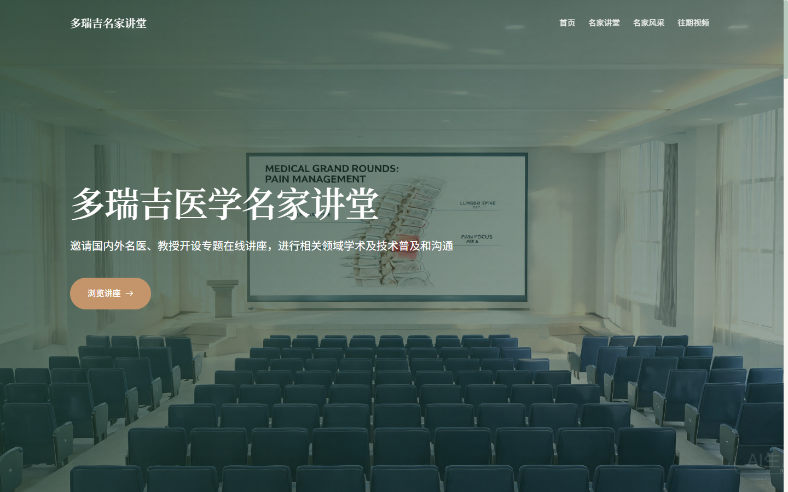
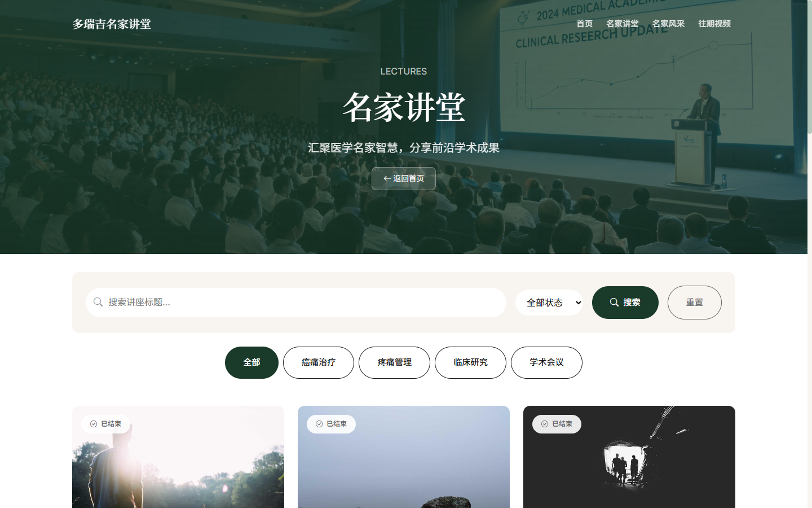
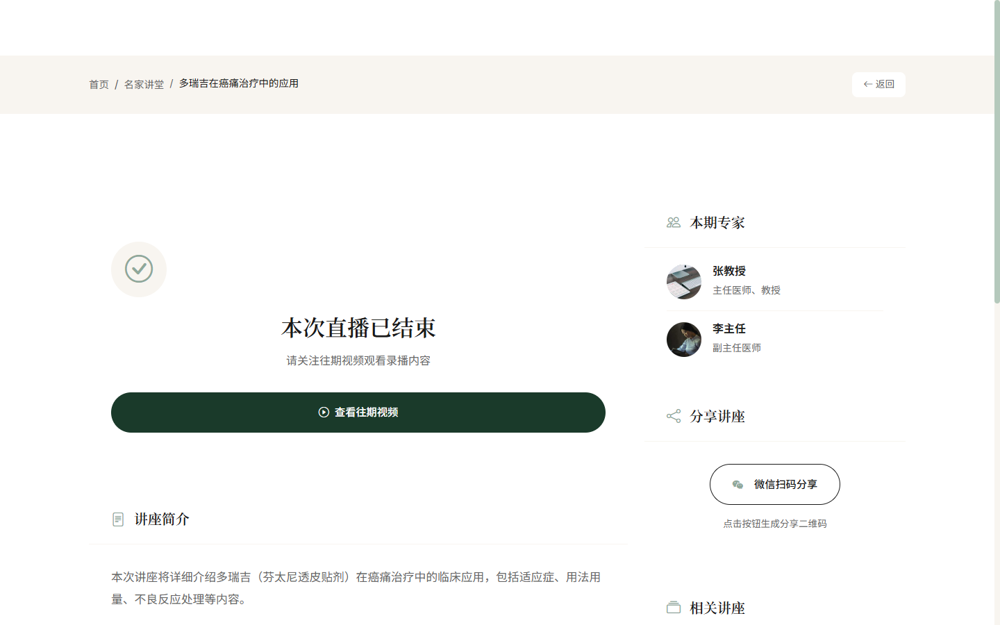
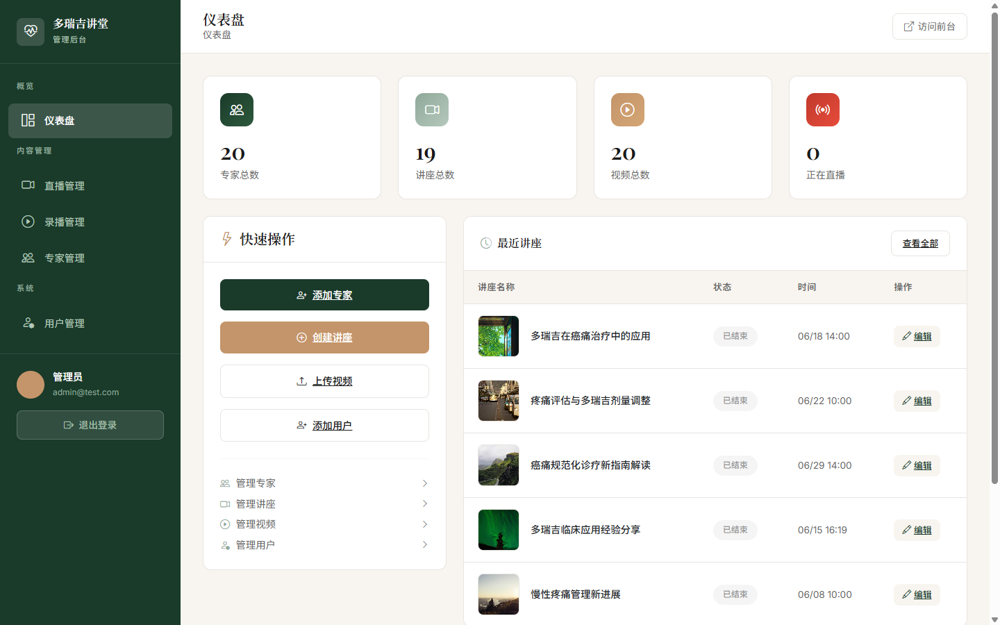

# 多瑞吉医学名家讲堂

一个面向医学教育的讲座直播与视频回放平台。

想直接上手操作、了解怎么配置运行？请看 [使用说明书（docs/使用说明书.md）](docs/使用说明书.md)。

医生专家在这里发布疼痛管理相关的专题讲座（支持直播、回放、二维码分享），学员可以浏览讲座、查看专家名片、观看录播视频。本项目是本科课程设计，前后端一体的单体应用。

## 功能特性

### 前台（面向学员）

- **首页**：平台介绍、在线讲座推荐、专家名医展示
- **讲座模块**：讲座列表、分类筛选、详情页、直播状态管理
- **专家模块**：专家列表与详情、专家出诊/学术名片
- **视频模块**：录播视频列表与播放，支持生成专属二维码分享
- **用户系统**：注册、登录、密码找回、邮箱验证

### 后台（面向管理员）

- 数据看板：平台内容概览统计
- 讲座管理：发布、编辑、上下线讲座
- 专家管理：维护专家资料与头像
- 视频管理：上传封面、绑定视频文件
- 用户管理：账号维护、权限标记
- 富文本编辑器 + 图片上传

### 演示账号

| 角色 | 邮箱 | 密码 |
|------|------|------|
| 管理员 | admin@test.com | 123456 |
| 测试用户 | user1@test.com | password |

> 以上账号仅用于本地演示。部署到公网前必须修改默认密码，并关闭不需要的测试账号。

## 技术栈

| 层级 | 技术 |
|------|------|
| 后端 | PHP + Laravel 8.x |
| 前端 | Bootstrap 5 + jQuery + Blade 模板（Laravel Mix 构建） |
| 数据库 | MySQL 5.7+ |
| 认证 | Laravel UI / Sanctum |
| 图片处理 | Intervention Image |
| 测试 | PHPUnit 9.x |

## 界面预览

### 前台首页



### 讲座检索与分类



### 讲座详情



### 后台仪表盘



## 快速开始

### 环境要求

- PHP >= 7.4（推荐 7.4 / 8.0），Windows 下建议同时开启扩展：`pdo_mysql`、`gd`、`fileinfo`、`mbstring`、`openssl`
- Composer >= 2.0
- MySQL >= 5.7

安装后可用 `php -v` / `composer --version` / `mysql --version` 验证。

### 步骤

```bash
# 1. 安装 PHP 依赖
composer install

# 2. 复制环境配置并修改数据库账号密码
copy .env.example .env

# 3. 生成应用密钥
php artisan key:generate

# 4. 创建数据库并迁移填充
#    先建库：CREATE DATABASE duoruiji DEFAULT CHARACTER SET utf8mb4;
php artisan migrate --seed

# 5. 创建存储软链接（否则页面图片不显示）
php artisan storage:link

# 6. 启动服务
php artisan serve
#    Note: Windows 若提示 php 不是命令，请把 PHP 目录加入 PATH；如果无法访问，
#    确认 php.ini 已开启 pdo_mysql / openssl 等扩展。
```

之后访问：

- 前台首页：http://127.0.0.1:8000
- 后台管理：http://127.0.0.1:8000/admin

> 说明：演示用的专家头像、讲座/视频封面与示例视频已随仓库提供（约 24MB，位于 `storage/app/public/`）。clone 后执行上面的 `storage:link` 即可正常显示图片并播放示例视频，无需额外准备。若想联网重新生成占位图，可运行 `php artisan seed:test-media`。

## 目录结构

```
duoruiji/
├── app/
│   ├── Console/Commands/      # 自定义命令（讲座状态定时更新等）
│   ├── Http/Controllers/
│   │   ├── Admin/            # 后台控制器
│   │   └── Frontend/         # 前台控制器
│   ├── Http/Middleware/       # 中间件（含 admin 权限校验）
│   ├── Http/Requests/         # 表单验证
│   └── Models/                # Expert / Lecture / Video / User
├── database/
│   ├── migrations/            # 数据表迁移
│   └── seeders/               # 演示数据填充
├── public/                    # Web 入口与静态资源
├── resources/views/           # Blade 模板（frontend / admin / auth）
├── routes/web.php             # 路由定义
└── tests/                     # 测试
```

## 开发过程中遇到的问题

挑几个印象比较深的、排查起来挺费劲的坑记录一下：

1. **突然整站连不上、`php artisan serve` 起不来**：查了很久，最后发现是 Winget 装的 PHP 没配置 `php.ini`，导致 `pdo_mysql`、`openssl` 等扩展一个都没加载，框架引导阶段连带端口监听失败。复制一份 `php.ini-development` 为 `php.ini` 并开启扩展后就正常了。这个教训是：**遇到"莫名其妙的启动失败"，先查环境（扩展 / 配置文件），再怀疑代码。**

2. **页面图片一片空白**：根源有两个——一是 `public/storage` 软链接在 Windows 上打压缩包时丢失了，`php artisan storage:link` 重建即可；二是一些装饰图引用了 Unsplash 外链，但在国内访问超时，直接把图片资源本地化才稳妥。

3. **二维码临时图被反复改动**：`public/assets/plugins/phpqrcode/` 下的 `temp`、`cache` 是运行时动态生成的，之前差点被一起提交进版本库，后来意识到这类运行时产物要加到 `.gitignore`。

## AI 辅助开发说明

本项目由本人独立负责课程需求落地，开发过程中使用 AI 编程工具辅助代码生成、问题定位、测试用例补充和文档整理。本人负责拆分需求、提供项目上下文与技术约束，并通过页面运行、代码差异、数据库记录和测试用例检查生成结果。

## 运行测试

```bash
php artisan test
```

> 注意：当前测试配置尚未与开发数据库完全隔离，直接执行测试可能清空 `.env` 指向的数据库。请先配置独立测试数据库或 SQLite 内存数据库，再运行完整测试套件；不要对保存重要数据的数据库执行测试。

## License

本项目是本科课程设计与学习项目，代码采用 [MIT License](LICENSE) 开源。仓库内的演示数据和媒体素材仅用于功能展示，不属于 MIT 授权范围，请勿直接用于商业用途。
